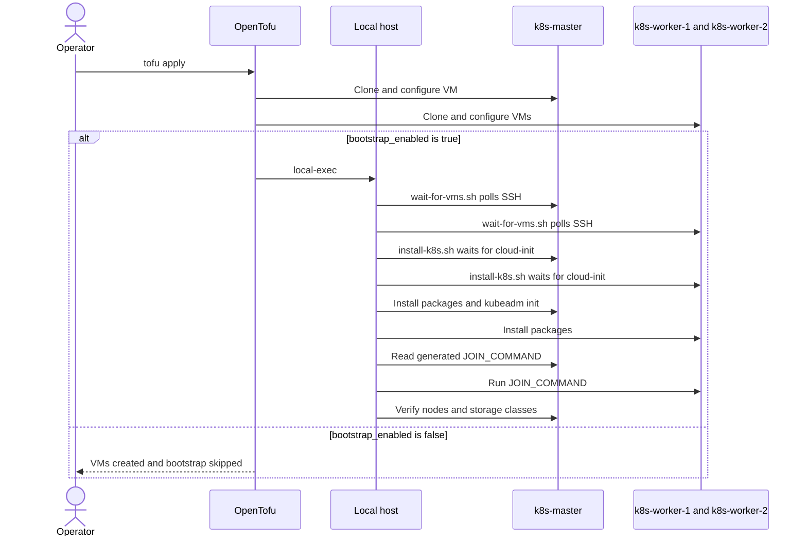
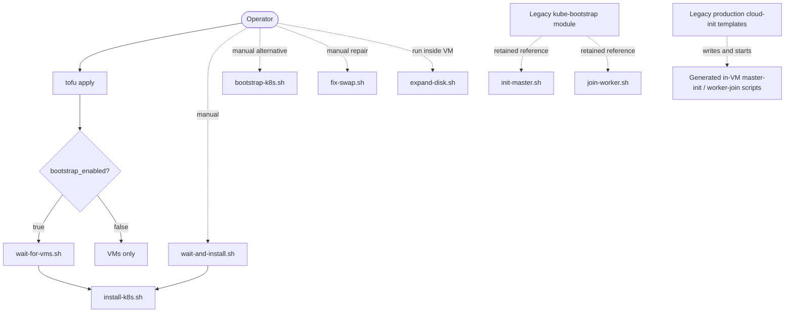

# Proxmox Kubernetes Infrastructure

Technical documentation for the OpenTofu/Terraform configuration.

## Architecture

### VMs
- **k8s-master** (VM 251): 10.100.1.101 - Control plane
- **k8s-worker-1** (VM 252): 10.100.1.102 - Worker node
- **k8s-worker-2** (VM 253): 10.100.1.103 - Worker node

### Specifications
- **Memory**: 16GB per VM
- **CPU**: 8 vCPUs per VM
- **Disk**: 32GB per VM (from template)
- **Network**: /14 subnet (10.100.0.0/14)
- **Gateway**: 10.100.0.1
- **DNS**: 8.8.8.8, 8.8.4.4

## Files

### Core Terraform Files
- **main.tf**: VM resource definitions using bpg/proxmox provider
- **variables.tf**: Input variable declarations
- **providers.tf**: Proxmox provider configuration
- **versions.tf**: Provider version constraints
- **outputs.tf**: Output values (VM IPs, etc.)
- **terraform.tfvars**: Your local configuration (gitignored)
- **terraform.tfvars.example**: Template for configuration

### Scripts
- **scripts/wait-for-vms.sh**: Waits for all three VMs to accept SSH connections
- **scripts/install-k8s.sh**: Installs Kubernetes, initializes the control plane, and joins both workers
- **scripts/bootstrap-k8s.sh**: Environment-driven, retry-aware alternative bootstrap workflow
- **scripts/wait-and-install.sh**: Manual wrapper around cloud-init waiting and `install-k8s.sh`
- **scripts/fix-swap.sh**: Manual repair that disables swap and restarts kubelet on every node
- **scripts/expand-disk.sh**: Manual in-guest LVM and filesystem expansion utility
- **scripts/init-master.sh**: Legacy control-plane initialization script
- **scripts/join-worker.sh**: Legacy worker join template with unresolved placeholders

## Workflow and Script Call Map

### Active OpenTofu Workflow

The actors below are rendered as stick figures by Mermaid. Automatic Kubernetes installation only runs when `bootstrap_enabled = true`; its default is `false`.



The exact active call chain is:

```text
tofu apply
`-- main.tf: null_resource.kubernetes_install (conditional)
  `-- local-exec
    |-- scripts/wait-for-vms.sh
    |   `-- ssh -> master + both workers
    `-- scripts/install-k8s.sh MASTER_IP WORKER1_IP WORKER2_IP
      |-- ssh -> cloud-init status --wait on every node
      |-- COMMON_SETUP -> master + both workers
      |-- MASTER_INIT -> master
      |-- extract JOIN_COMMAND <- master:/tmp/join-command.sh
      |-- execute JOIN_COMMAND -> both workers
      `-- kubectl verification -> master
```

### All Workflow Entry Points



| Script | What calls it | Functions or operations performed | Status |
|---|---|---|---|
| `wait-for-vms.sh` | Root `main.tf` local-exec; operator may run it manually | Polls SSH on the three hardcoded node IPs for up to 60 attempts | Active when `bootstrap_enabled = true` |
| `install-k8s.sh` | Root `main.tf`; `wait-and-install.sh`; operator | Waits for cloud-init, runs `COMMON_SETUP`, runs `MASTER_INIT`, extracts the join command, joins workers, installs storage, verifies cluster | Active when called; not idempotent after `kubeadm init` |
| `bootstrap-k8s.sh` | No repository caller; operator supplies environment variables | Defines `run_ssh`, `run_remote_script`, `wait_for_apt`, `wait_for_ssh`, and `common_setup`; performs an idempotent cluster bootstrap | Standalone alternative |
| `wait-and-install.sh` | No repository caller; operator | Waits for cloud-init on fixed IPs, then calls `install-k8s.sh` by absolute local path | Manual wrapper |
| `fix-swap.sh` | No repository caller; operator | Disables swap, edits `/etc/fstab`, removes `/swap.img`, restarts kubelet, checks nodes | Manual repair |
| `expand-disk.sh` | No repository caller; operator runs it inside a VM | Installs `growpart` if needed, then expands `/dev/sda3`, the LVM PV/LV, and ext4 filesystem | Manual utility |
| `init-master.sh` | Retained `modules/kube-bootstrap/main.tf` only | Uses the retired Kubernetes apt repository, initializes a control plane, writes kubeconfig, applies Calico | Legacy; contains `your-username` placeholder |
| `join-worker.sh` | Retained `modules/kube-bootstrap/main.tf` only | Runs `kubeadm join` | Legacy; contains unresolved master, token, and hash placeholders |

The cloud-init YAML files do **not** call the repository's `.sh` files. The retained production configuration injects the templates, which create and launch `/usr/local/bin/k8s-master-init.sh` and `/usr/local/bin/k8s-worker-join.sh` inside the VMs. Those templates repeat disk expansion, package installation, control-plane initialization, and worker joining as a separate legacy workflow.

### Script Variables and Extracted Values

| Script | Variable | Source or extraction |
|---|---|---|
| `wait-for-vms.sh` | `i` | Brace expansion `{1..60}` attempt counter |
| `wait-for-vms.sh` | `all_ready` | Boolean set from the result of all SSH probes |
| `wait-for-vms.sh` | `ip` | Each hardcoded IP: `10.100.1.101`, `.102`, and `.103` |
| `install-k8s.sh` | `MASTER_IP`, `WORKER1_IP`, `WORKER2_IP` | Positional arguments `$1`, `$2`, `$3`, each with a hardcoded default |
| `install-k8s.sh` | `SSH_USER` | Constant `ubuntu` |
| `install-k8s.sh` | `SSH_KEY` | Derived from `$HOME/.ssh/id_rsa` |
| `install-k8s.sh` | `COMMON_SETUP`, `MASTER_INIT` | Multiline command strings sent to nodes over SSH |
| `install-k8s.sh` | `ip` | Loop value for each node while waiting for cloud-init |
| `install-k8s.sh` | `JOIN_COMMAND` | Command substitution reading `/tmp/join-command.sh` from the master over SSH |
| `bootstrap-k8s.sh` | `MASTER_IP`, `WORKER_IPS`, `SSH_USER`, `SSH_PRIVATE_KEY` | Required environment variables; `WORKER_IPS` is captured as `WORKER_IPS_CSV` |
| `bootstrap-k8s.sh` | `K8S_VERSION`, `POD_CIDR` | Optional environment variables, defaulting to `1.30` and `10.244.0.0/16` |
| `bootstrap-k8s.sh` | `K8S_SERIES` | Extracted with `awk` from the first two components of `K8S_VERSION`, prefixed with `v` |
| `bootstrap-k8s.sh` | `SSH_PRIVATE_KEY` | Tilde-expanded using `$HOME` |
| `bootstrap-k8s.sh` | `WORKER_IPS` | Array split from comma-separated `WORKER_IPS_CSV` using `IFS=,` |
| `bootstrap-k8s.sh` | `ALL_NODES` | Array composed from `MASTER_IP` and `WORKER_IPS` |
| `bootstrap-k8s.sh` | `ssh_opts` | Array assembled from the private key and SSH timeout/keepalive options |
| `bootstrap-k8s.sh` | `host`, `cmd`, `script`, `attempt`, `exit_code`, `stable_checks` | Function-local arguments, captured stdin, retry counters, and SSH status |
| `bootstrap-k8s.sh` | `node`, `worker` | Loop values extracted from `ALL_NODES` and `WORKER_IPS` |
| `bootstrap-k8s.sh` | `JOIN_COMMAND` | Output of `kubeadm token create --print-join-command` over SSH |
| `wait-and-install.sh` | `ip` | Each of the three hardcoded node IPs |
| `fix-swap.sh` | `MASTER_IP`, `WORKER1_IP`, `WORKER2_IP` | Positional arguments `$1`, `$2`, `$3`, each with a hardcoded default |
| `fix-swap.sh` | `FIX_SWAP` | Multiline repair command sent to each node over SSH |
| `fix-swap.sh` | `ip` | Loop value from the three node IP variables |
| `expand-disk.sh` | None | Device and LVM paths are constants; no shell variables are assigned |
| `init-master.sh` | `KUBECONFIG` | Exported constant `/etc/kubernetes/admin.conf` |
| `join-worker.sh` | `MASTER_IP`, `TOKEN`, `DISCOVERY_HASH` | Literal unresolved placeholders, not extracted dynamically |

Only `master_ip` and the first two elements of `worker_ips` flow from root Terraform variables into a shell script. The declared Terraform variables `ssh_username`, `ssh_private_key_file`, `kubernetes_version`, and `pod_network_cidr` are currently **not** passed to `install-k8s.sh`; that script uses its own constants. `bootstrap-k8s.sh` accepts equivalent settings through environment variables but has no Terraform caller.

## Usage

### Initial Setup
```bash
# Copy example configuration
cp terraform.tfvars.example terraform.tfvars

# Edit with your Proxmox details
vim terraform.tfvars

# Initialize provider
tofu init
```

### Deploy Infrastructure
```bash
# Preview changes
tofu plan

# Apply configuration
tofu apply -auto-approve
```

### Install Kubernetes
```bash
# Wait for VMs to be ready
bash scripts/wait-for-vms.sh

# Install Kubernetes on all nodes
bash scripts/install-k8s.sh
```

### Access Cluster
```bash
# SSH to master
ssh ubuntu@10.100.1.101

# Default password: ubuntu123!
# Change password after first login
```

### Destroy Infrastructure
```bash
tofu destroy -auto-approve
```

## Configuration Variables

Key variables in `terraform.tfvars`:

```hcl
# Proxmox Connection
proxmox_host      = "https://10.100.0.10:8006"
proxmox_api_user  = "admin@pve"
proxmox_api_token = "your-token-id=your-token-secret"
proxmox_node      = "pve"

# VM Template
template_id = 9001  # Ubuntu 24.04 cloud-init template

# VM Resources
vm_memory = 16384   # MB
vm_cpu    = 8       # vCPUs
vm_disk   = 32      # GB

# Network Configuration
master_ip  = "10.100.1.101"
worker1_ip = "10.100.1.102"
worker2_ip = "10.100.1.103"
gateway    = "10.100.0.1"
```

## Provider Details

Using **bpg/proxmox** provider (>= 0.66.0):
- More actively maintained than telmate/proxmox
- Better cloud-init support
- Improved SSH configuration handling
- Direct API token authentication

## Network Architecture

The cluster uses a /14 subnet (10.100.0.0/14) which covers:
- 10.100.0.0 - 10.103.255.255
- Supports 262,144 IP addresses
- Master and workers in 10.100.1.0/24 range

## Kubernetes Installation Details

The `install-k8s.sh` script performs these steps:

1. **Common Setup** (all nodes):
   - Disable swap
   - Load kernel modules (overlay, br_netfilter)
   - Configure sysctl for networking
   - Install containerd with systemd cgroup driver
   - Add Kubernetes repository
   - Install kubelet, kubeadm, kubectl

2. **Master Initialization**:
   - Run `kubeadm init` with pod CIDR 10.244.0.0/16
   - Configure kubectl for ubuntu user
   - Deploy Calico CNI
   - Install local-path storage provisioner
   - Generate join token

3. **Worker Join**:
   - Execute join command on each worker
   - Workers connect to master and join cluster

4. **Verification**:
   - Display node status
   - Display storage classes
   - Confirm cluster health

## Storage

**Local Path Provisioner** (Rancher):
- Dynamically provisions PersistentVolumes
- Uses local storage on each node
- Set as default StorageClass
- Path: `/opt/local-path-provisioner`

Test storage:
```bash
kubectl apply -f - <<EOF
apiVersion: v1
kind: PersistentVolumeClaim
metadata:
  name: test-pvc
spec:
  accessModes:
    - ReadWriteOnce
  storageClassName: local-path
  resources:
    requests:
      storage: 1Gi
EOF
```

## Troubleshooting

### VMs not accessible
```bash
# Check Proxmox console for cloud-init status
# Cloud-init takes ~2 minutes to complete

# Verify network connectivity
ping 10.100.1.101

# Check SSH manually
ssh -v ubuntu@10.100.1.101
```

### Installation fails
```bash
# Re-run installation (idempotent)
bash scripts/install-k8s.sh

# Check individual node
ssh ubuntu@10.100.1.101
sudo systemctl status kubelet
sudo journalctl -xeu kubelet
```

### State issues
```bash
# If state becomes corrupted
rm terraform.tfstate*
tofu import proxmox_virtual_environment_vm.master 251
tofu import proxmox_virtual_environment_vm.worker[0] 252
tofu import proxmox_virtual_environment_vm.worker[1] 253
```